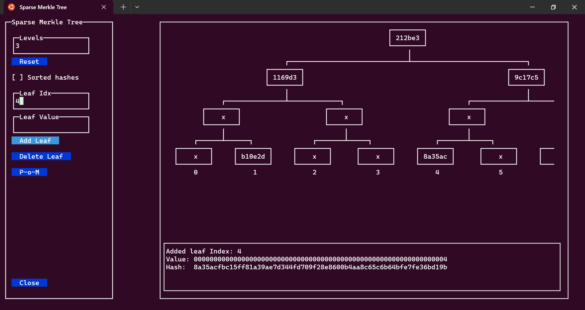

# zkYes - Sparse Merkle Tree Research

This repositroy includes research for Sparse Merkle Tree implementations.
This is a subproject of the zkYes voting solution.

The repository is composed of various sub-projects analyzing previous work as well as our own implementations:

* [vitalik_merkle_optimizations](./vitalik_merkle_optimizations/README.md) - Analysis of the client-side optimizations proposed by Vitalik Buterin.

* [openzeppelin_pom](./openzeppelin_pom/README.md) - OpenZeppelin helpers for verifying proof-of-membership.

* [solarity_tree](./solarity_tree/README.md) - Review of the solidtiy Sparse Merkle Tree implementation within the Solarity library.

* [iden3_tree](./iden3_tree/README.md) - Review of the iden3 Sparse Merkle Tree implementation.

* [merkle](./merkle/README.md) - Our own Node.js/typescript implementation of various Sparse Merkle Tree optimizations. 

* [merkle-ui](./merkle_ui/README.md) - A console-based graphical interface that helps visualizing SMT implementation and other testing tools.

